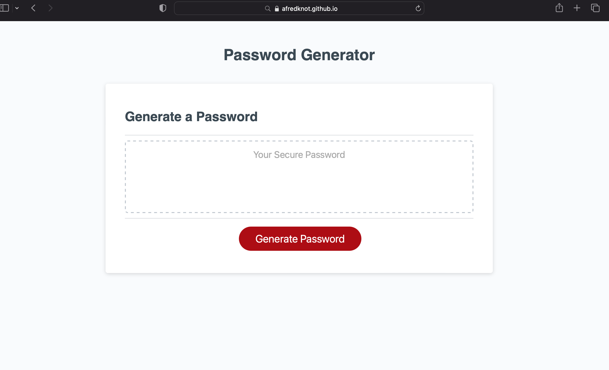

# Password Generator Starter Code

This is for creating a password, and one that can hopefully be mostly unbreakable. It can generate random passwords of different lenghts and you can choose between 4 styles and 120 different lenghts.

## installation

if you would like to use this password generator, you can go to 
https://afredknot.github.io/randogen/
select generate code and recieve prompts that will generate your password

if you would like to review code in visual studio code
go to 
https://github.com/afredknot/randogen
the easiest way is to copy as either ssh or https
create a folder in desired location
open a terminal window 
type git clone and paste selected code
files will load into your folder
you can then type code. 
vs code will open the cloned repository and you can view

## usage
Generate a random password that can include numbers, special characters, upper or lowercase letters.

## credits

Ohio State University Full Stack Bootcamp for providing the starter code (html, CSS, and beginnning of the Javascript)